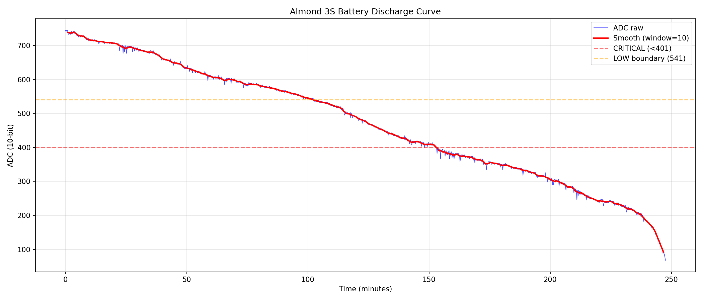

# Battery Remaining Time Estimation — Алгоритм

**Цель**: оценка оставшегося времени работы роутера Almond 3S от батареи.
**Реализация**: C в `data_collector.c`, результат в JSON → `lcd_ui.uc` отображает.
**Платформа**: MIPS 1004Kc (soft-float), static binary via zig cc.

---

## 1. Исходные данные

### 1.0 Батарея

**Модель**: 18650-251P, 2S (2 последовательно)
- Ёмкость: 3200 mAh
- Энергия: 23.68 Wh

### 1.1 Источник ADC

PIC16LF1509 через I2C (cmd 0x36) возвращает 10-bit ADC (0–1023).
`data_collector` уже читает батарею каждые 2 секунды через `get_battery()` → `ioctl(fd, 2, raw)`.

Текущий JSON output:
```json
"battery": {"adc": 628, "percent": 50, "charging": false, "valid": true}
```

**Нужно добавить поля:**
```json
"battery": {
    "adc": 628, "percent": 50, "charging": false, "valid": true,
    "remain_min": 87, "drain_rate": 2.15
}
```
- `remain_min` — оставшееся время в минутах (-1 = неизвестно)
- `drain_rate` — текущая скорость разряда в ADC/мин (0 = не разряжается)

### 1.2 Характеристики батареи (из тестового разряда)

Полный разряд записан в `Battery_Drain_logs1.txt`:
- **1213 строк** в логе, **1203 прошли валидацию** (buf[3]==0x02 && buf[4]==0x04)
- **11 corrupted reads** (~0.9%) — отбрасываются валидатором
- Длительность: **4.13 часа**

```
Start ADC: 745 (полная зарядка, без зарядного)
End ADC:   68  (последняя запись перед отключением)
```

**ВАЖНО**: конец кривой (ADC < 200) — НЕ монотонный, скачет. В зоне ADC < 100
батарея нестабильна, оценка бессмысленна.

Интервал семплирования ядром: **~12 секунд** (mean=12.4s, median=12.2s, max=36.5s).
data_collector опрашивает каждые 2 секунды, но ядро обновляет ADC реже → одинаковые значения подряд.

Шум ADC: **±2–3 единицы** между соседними чтениями при стабильном разряде.
При ~12с интервале и скорости ~2 ADC/мин, реальное изменение за 1 сэмпл — ~0.4 ADC.
**Signal-to-noise при коротком окне** — главная проблема оценки.

### 1.3 Формат buf[5] (charging + battery detect)

| Сценарий | buf[5] | bin | Описание |
|----------|--------|-----|----------|
| Разряд (батарея есть) | 0x00 | 00000000 | Нет зарядки |
| Зарядка (батарея, начало) | 0x01 | 00000001 | bit0 = charging |
| Зарядка (батарея, стабильно) | 0x09 | 00001001 | bit0=1, bit3=1 (норма!) |
| Нет батареи + зарядник | 0x69 | 01101001 | bit5+bit6 = no battery |
| Нет батареи (переходное) | 0x49 | 01001001 | bit6=1 |
| Вставка батареи (переход) | 0x41 | 01000001 | bit6=1, быстро → 0x01 |

**Биты buf[5]:**
- bit0 = зарядка (0=нет, 1=да)
- bit3 = неизвестно (появляется и с батареей и без)
- bit5+bit6 = **нет батареи** (только когда батарея физически отключена)

**Детекция:**
```c
bi->charging = (raw[5] & 0x01) ? 1 : 0;      // bit0 = зарядка
bi->no_battery = (raw[5] & 0x60) ? 1 : 0;     // bit5+bit6 = нет батареи
```

При вставке батареи: buf[5] переходит 0x69 → 0x41 → 0x01 за ~1-2 цикла (~12-24 сек).
При отключении батареи: buf[5] переходит 0x01 → 0x69 мгновенно, ADC растёт (зарядник напрямую).

### 1.4 Alt-формат PIC (buf[3]=0x01, buf[4]=0x02)

При старте зарядки от мёртвой батареи PIC первые ~5 мин выдаёт **другой формат**:
buf[3]=0x01, buf[4]=0x02, ADC=830→951 — это напряжение **зарядника**, не батареи.
Затем PIC переключается в стандартный режим (buf[3]=0x02, buf[4]=0x04), ADC сбрасывается
и начинает отражать реальное напряжение батареи (от ~8 вверх).

Этот alt-формат **фильтруется** валидацией `buf[3]==0x02 && buf[4]==0x04`.
Но стоит знать: если увидим ADC > 800 с buf[3]=0x01 — это НЕ суперзаряженная батарея,
а PIC в калибровочном режиме.

### 1.5 Форма кривой РАЗРЯДА

Кривая разряда **НЕ линейная** — типичная Li-ion:



```
ADC 745→700:  22 мин  (быстрый начальный спад)
ADC 700→600:  43 мин  (плавный средний участок, ~2 ADC/мин)
ADC 600→500:  51 мин  (плавный, ~2 ADC/мин)
ADC 500→400:  38 мин  (ускоряется, ~3 ADC/мин)
ADC 400→300:  48 мин  (замедляется, ~2 ADC/мин)  ← ниже порога CRITICAL
ADC 300→200:  37 мин  (ускоряется, ~3 ADC/мин)
ADC 200→100:   9 мин  (обвал, ~11 ADC/мин) ← батарея мёртвая
```

**Ключевые пороги (из stock firmware):**
| ADC | Значение |
|-----|----------|
| ≥542 | NORMAL (20–100%) |
| 401–541 | LOW (1–20%) |
| <401 | CRITICAL (0%) |

### 1.6 Формула процента заряда — ТРЕБУЕТ ЗАМЕНЫ

**Полный заряд батареи = ADC 800** (не 745!). Подтверждено полным циклом зарядки
(`bat_full.txt`): стабильные значения 0xC8-0xC9 → ADC 802-806. LOG1 начал разряд
с ADC=745 — батарея была заряжена лишь на ~86%.

**Текущая формула** (data_collector.c, строка ~58):
```c
if (bi->adc < 401) bi->percent = 0;
else if (bi->adc < 542) bi->percent = (bi->adc - 401) * 20 / 141;
else bi->percent = 20 + (bi->adc - 542) * 80 / 481;
```

**Проблема**: формула из stock firmware рассчитана на max ADC=1023, реальный = 800.
При ADC 800 (полный заряд) показывает **62%**.

**Новая формула** — через таблицу разряда (bat_table_lookup уже нужен для remain_min):
```c
bi->percent = bat_table_lookup(bi->adc) * 100 / 177;
```

`bat_table_lookup(adc)` возвращает минуты до ADC=400, 177 = макс (при ADC 800).
Одна строка, **отдельная таблица не нужна**, точность = кривой разряда.

| ADC | Процент | Описание |
|-----|---------|----------|
| 800 | 100% | Полный заряд |
| 750 | 86% | |
| 700 | 73% | |
| 650 | 62% | |
| 600 | 50% | Половина |
| 575 | 38% | |
| 550 | 32% | |
| 525 | 24% | |
| 500 | 21% | Пятая часть |
| 450 | 12% | |
| 425 | 7% | |
| 400 | 0% | CRITICAL |

**Альтернатива** (если bat_table_lookup недоступен): `percent = (adc - 400) / 4`.
Линейная, max ошибка ±7% при ADC 525. Для грубой оценки — сойдёт.

### 1.7 Форма кривой ЗАРЯДКИ

Данные из `Battery_Charge_logs2.txt` + `Battery_Charge_logs2_cont.txt`:
зарядка от мёртвой батареи (ADC=8 → 480), ~51 мин (зарядка не завершена).

Типичный Li-ion профиль зарядки:

**CC-фаза (Constant Current)** — ADC растёт быстро:
```
ADC   0→ 50:   0.4 мин  (120 ADC/мин)
ADC  50→100:   0.6 мин  (81 ADC/мин)
ADC 100→150:   0.8 мин  (61 ADC/мин)
ADC 150→200:   1.0 мин  (48 ADC/мин)
ADC 200→250:   1.4 мин  (35 ADC/мин)
ADC 250→300:   1.8 мин  (27 ADC/мин)
```

**Переход CC→CV** — резкое замедление:
```
ADC 300→350:   5.1 мин  (10 ADC/мин — замедление в 3x)
```

**CV-фаза (Constant Voltage)** — ADC растёт медленно:
```
ADC 350→400:  14.2 мин  (3.5 ADC/мин)
ADC 400→450:  11.1 мин  (4.5 ADC/мин)
ADC 450→500:  19.2 мин  (2.6 ADC/мин)  ← яма, потом восстанавливается
ADC 500→650:  ~50  мин  (~3.0 ADC/мин)  ← нет прямых данных, оценка
ADC 650→700:  10.1 мин  (3.4 ADC/мин)  ← bat_full.txt
ADC 700→750:   7.3 мин  (3.4 ADC/мин)
ADC 750→800:  11.1 мин  (4.5 ADC/мин)  ← ускоряется к концу!
```

**ВАЖНО**: CV-фаза НЕ замедляется экспоненциально как типичный Li-ion!
Скорость стабильна ~3.0-4.5 ADC/мин от ADC 400 до 800 (полный заряд).
Яма при ADC 450-500 (~2.6 ADC/мин) — единственное замедление.

**Полный заряд**: ADC **800** (стабильные 0xC8-0xC9 при подключённом зарядном).

**Полный цикл** (от мёртвой батареи):
- ADC 0→400: ~25 мин (быстро, CC-фаза)
- ADC 400→800: ~124 мин (CV-фаза, ~3.2 ADC/мин средняя)
- **Итого: ~2.5 часа от мёртвой до полного**

### 1.8 Таблица ADC → оставшееся время РАЗРЯДА (эмпирическая, сглаженная)

Из тестового разряда, smoothing window=11.
Таблица до ADC=400 (CRITICAL), ниже — доп. столбец до ADC=100 (реальный конец жизни).

**ОГРАНИЧЕНИЕ**: таблица основана на ОДНОМ тесте разряда при нагрузке WiFi+LTE+LCD+touch.
При другой нагрузке время может отличаться. Linreg-коррекция компенсирует это.

| ADC | До ADC=400 (мин) | До ADC=100 (мин) | Локальная скорость (ADC/мин) |
|-----|-------------------|-------------------|------------------------------|
| 750 | 152 | 245 | 1.8 |
| 725 | 145 | 238 | 2.1 |
| 700 | 130 | 224 | 1.5 |
| 675 | 116 | 209 | 2.7 |
| 650 | 109 | 202 | 3.1 |
| 625 | 100 | 193 | 2.9 |
| 600 | 88 | 182 | 1.5 |
| 575 | 68 | 162 | 1.7 |
| 550 | 56 | 149 | 2.2 |
| 525 | 43 | 137 | 3.0 |
| 500 | 37 | 130 | 3.5 |
| 475 | 29 | 122 | 3.5 |
| 450 | 22 | 115 | 3.2 |
| 425 | 12 | 106 | 2.2 |
| 400 | 0 | 93 | 2.7 |

---

## 2. Алгоритм

### 2.1 Обзор

Два механизма:

1. **Lookup table** — эмпирическая таблица ADC → minutes_remaining (основная оценка)
2. **Linear regression** — по последним N ADC точкам, определяет drain_rate и детектирует "не разряжается"

Формула:
```
remain = table_remain(current_adc) * user_cal_factor
```

Linreg НЕ корректирует таблицу (см. секцию 5.3 — коррекция ухудшает результат).
Linreg нужен для: drain_rate в JSON, детекции slope >= 0 (не разряжается).

### 2.2 Кольцевой буфер (ring buffer)

```c
#define BAT_HIST_MAX 30  // максимальный размер (аллоцируется статически)

struct bat_sample {
    time_t t;   // epoch seconds
    int adc;    // 10-bit ADC
};

struct bat_estimator {
    struct bat_sample hist[BAT_HIST_MAX];
    int count;       // сколько заполнено (0..hist_size)
    int head;        // следующая позиция для записи
    int remain_min;  // результат: оставшееся время (-1 = неизвестно)
    int drain_rate;  // ADC/мин * 100 (fixed-point, положительное = разряд)
    int was_charging;  // для детекции перехода charge→discharge
};
```

**Рекомендуемые defaults:**
- `hist_size = 20` — 20 точек
- `min_interval = 30` секунд между точками
- Итого окно: 20 * 30 = 600 секунд = **10 минут**
- За 10 мин ADC падает на ~20 единиц → SNR ~7:1 (vs шум ±3)

**Правила заполнения:**
1. Добавлять точку ТОЛЬКО если `battery.valid == true`
2. Добавлять ТОЛЬКО если `battery.charging == false` (bit0 buf[5] = 0)
3. Добавлять ТОЛЬКО если прошло `>= min_interval` секунд от последней точки
4. При переходе charging→discharging — очистить буфер (начинать заново)

### 2.3 Linear Regression (целочисленная)

Вся арифметика на **int64_t** — soft-float double на MIPS ~50x медленнее.
drain_rate хранится как fixed-point: `rate_x100 = ADC/мин * 100`.

Когда в буфере >= 3 точки:

```c
void bat_calc_slope(struct bat_estimator *est, int *slope_x1000) {
    // slope_x1000 = ADC/сек * 1000 (отрицательное при разряде)
    int n = est->count;
    int oldest = (est->head - n + BAT_HIST_MAX) % BAT_HIST_MAX;
    int64_t t0 = (int64_t)est->hist[oldest].t;

    int64_t sum_t = 0, sum_a = 0, sum_tt = 0, sum_ta = 0;
    for (int i = 0; i < n; i++) {
        int idx = (oldest + i) % BAT_HIST_MAX;
        int64_t t = (int64_t)(est->hist[idx].t) - t0;
        int64_t a = (int64_t)est->hist[idx].adc;
        sum_t += t;
        sum_a += a;
        sum_tt += t * t;
        sum_ta += t * a;
    }

    int64_t denom = (int64_t)n * sum_tt - sum_t * sum_t;
    if (denom == 0) { *slope_x1000 = 0; return; }

    // slope * 1000 = (n * sum_ta - sum_t * sum_a) * 1000 / denom
    int64_t numer = ((int64_t)n * sum_ta - sum_t * sum_a);
    *slope_x1000 = (int)(numer * 1000 / denom);
}
```

Скорость разряда (ADC/мин * 100):
```c
// slope_x1000 отрицательный → drain_rate_x100 положительный
est->drain_rate = (int)(-(int64_t)slope_x1000 * 60 / 10);  // *60/1000*100 = *60/10
```

### 2.4 Lookup table (встроенная)

Таблица с шагом 25 ADC, сглаженная (window=11). Интерполяция линейная, целочисленная.

```c
struct bat_table_entry { int adc; int min_to_400; };

static const struct bat_table_entry bat_table[] = {
    {800, 177}, {775, 165}, {750, 152}, {725, 145}, {700, 130},
    {675, 116}, {650, 109}, {625, 100}, {600,  88}, {575,  68},
    {550,  56}, {525,  43}, {500,  37}, {475,  29}, {450,  22},
    {425,  12}, {400,   0},
};
#define BAT_TABLE_SIZE 17

int bat_table_lookup(int adc) {
    if (adc >= 800) return 177;
    if (adc <= 400) return 0;
    for (int i = 0; i < BAT_TABLE_SIZE - 1; i++) {
        if (adc >= bat_table[i + 1].adc) {
            int da = bat_table[i].adc - bat_table[i + 1].adc;  // всегда 25
            int dm = bat_table[i].min_to_400 - bat_table[i + 1].min_to_400;
            return bat_table[i + 1].min_to_400 + (adc - bat_table[i + 1].adc) * dm / da;
        }
    }
    return 0;
}
```

*Функция `bat_table_rate_x100` убрана — correction_factor не используется (см. 5.3).*

### 2.5 Оценка оставшегося времени

```c
void bat_estimate(struct bat_estimator *est, int cur_adc) {
    // 1. Таблица — основная оценка
    int tab_min = bat_table_lookup(cur_adc);

    // 2. Linreg — только для drain_rate и детекции "не разряжается"
    if (est->count >= 3) {
        int slope_x1000;
        bat_calc_slope(est, &slope_x1000);

        if (slope_x1000 >= 0) {
            // ADC не падает → не разряжается (шум или рост)
            est->remain_min = -1;
            est->drain_rate = 0;
            return;
        }

        // drain_rate_x100 = ADC/мин * 100 (информационное поле)
        est->drain_rate = (int)(-(int64_t)slope_x1000 * 60 / 10);
    }

    // 3. Результат = таблица * user_factor (без correction!)
    est->remain_min = (int)((int64_t)tab_min * bat_cal_factor / 100);
    if (est->remain_min < 0) est->remain_min = 0;
}
```

**Почему без correction_factor**: валидация на втором тесте (Points10aprl.txt)
показала, что коррекция ухудшает оценку (+60% ошибка vs +6% без неё).
Форма кривой разряда отличается между тестами, и correction усиливает расхождение.
Подробности — секция 5.3.

### 2.6 Главная функция (bat_update)

Вызывается каждые 2 секунды из main loop, после `get_battery()`:

```c
void bat_update(struct bat_estimator *est, struct battery_info *bi) {
    if (!bi->valid) {
        est->remain_min = -1;
        return;
    }

    // Детекция перехода charging → discharging
    if (bi->charging) {
        est->was_charging = 1;
        bat_hist_clear(est);
        est->remain_min = -1;
        est->drain_rate = 0;
        return;
    }
    if (est->was_charging) {
        bat_hist_clear(est);
        est->was_charging = 0;
    }

    // ADC < 100 — батарея мёртвая
    if (bi->adc < 100) {
        est->remain_min = 0;
        return;
    }

    // Throttle: добавлять точку не чаще min_interval
    time_t now = time(NULL);
    if (est->count > 0) {
        int last = (est->head - 1 + BAT_HIST_MAX) % BAT_HIST_MAX;
        if ((now - est->hist[last].t) < bat_cal_interval)
            goto calc;  // Не добавляем точку, но пересчитываем
    }

    // Push точку
    bat_hist_push(est, now, bi->adc);

calc:
    bat_estimate(est, bi->adc);
}
```

### 2.7 Оценка времени ЗАРЯДКИ (charge_remain_min)

При `charging == true` — оценить время до полного заряда (ADC=800).

**Подход: таблица зарядки** (аналогично разряду).
CV-фаза стабильна ~3-4 ADC/мин → таблица работает.

```c
// Charge table: {adc, minutes_to_800}
static const struct bat_table_entry charge_table[] = {
    {400, 124}, {425, 119}, {450, 113}, {475, 104},
    {500,  94}, {525,  86}, {550,  77}, {575,  69},
    {600,  61}, {625,  52}, {650,  44}, {675,  37},
    {700,  29}, {725,  22}, {750,  15}, {775,   7}, {800, 0},
};
#define CHARGE_TABLE_SIZE 17

int charge_table_lookup(int adc) {
    if (adc <= 400) return 124;
    if (adc >= 800) return 0;
    for (int i = 0; i < CHARGE_TABLE_SIZE - 1; i++) {
        if (adc >= charge_table[i + 1].adc) {
            // Impossible to be less than charge_table[i].adc here
            // because we iterate from lowest
        }
    }
    // Same interpolation logic as bat_table_lookup
    for (int i = 0; i < CHARGE_TABLE_SIZE - 1; i++) {
        if (adc < charge_table[i + 1].adc) {
            int da = charge_table[i + 1].adc - charge_table[i].adc;
            int dm = charge_table[i].min_to_800 - charge_table[i + 1].min_to_800;
            return charge_table[i + 1].min_to_800 + (charge_table[i + 1].adc - adc) * dm / da;
        }
    }
    return 0;
}
```

```c
void bat_charge_estimate(struct bat_estimator *est, int cur_adc) {
    // 1. Таблица
    int tab_min = charge_table_lookup(cur_adc);

    // 2. Linreg для charge_rate (информационное поле)
    if (est->count >= 3) {
        int slope_x1000;
        bat_calc_slope(est, &slope_x1000);
        if (slope_x1000 <= 0) {
            est->remain_min = -1;
            est->drain_rate = 0;
            return;
        }
        est->drain_rate = (int)((int64_t)slope_x1000 * 60 / 10);
    }

    // 3. Результат
    est->remain_min = tab_min * bat_cal_factor / 100;
    if (cur_adc >= 790) est->remain_min = 0;  // почти полный
}
```

**Когда показывать**:
- `charging == true` И `adc > 400` → "~Xh Ym до 100%"
- `charging == true` И `adc <= 400` → только "зарядка" (CC-фаза, непредсказуемо)
- `charging == true` И `adc >= 790` → "заряжено"

### 2.8 Модификация bat_update для зарядки

```c
void bat_update(struct bat_estimator *est, struct battery_info *bi) {
    if (!bi->valid) {
        est->remain_min = -1;
        return;
    }

    if (bi->charging) {
        // ЗАРЯДКА: тоже собираем точки и считаем rate
        if (!est->was_charging) {
            bat_hist_clear(est);  // переход discharge→charge
            est->was_charging = 1;
        }

        time_t now = time(NULL);
        if (est->count > 0) {
            int last = (est->head - 1 + BAT_HIST_MAX) % BAT_HIST_MAX;
            if ((now - est->hist[last].t) < bat_cal_interval)
                goto calc_charge;
        }
        bat_hist_push(est, now, bi->adc);

    calc_charge:
        bat_charge_estimate(est, bi->adc);
        return;
    }

    // РАЗРЯД (как раньше)
    if (est->was_charging) {
        bat_hist_clear(est);
        est->was_charging = 0;
    }

    if (bi->adc < 100) {
        est->remain_min = 0;
        return;
    }

    time_t now = time(NULL);
    if (est->count > 0) {
        int last = (est->head - 1 + BAT_HIST_MAX) % BAT_HIST_MAX;
        if ((now - est->hist[last].t) < bat_cal_interval)
            goto calc_discharge;
    }
    bat_hist_push(est, now, bi->adc);

calc_discharge:
    bat_estimate(est, bi->adc);
}
```

### 2.9 Когда НЕ показывать время

**Разряд:**
- `valid == false` → "?", remain_min = -1
- `adc < 100` → remain_min = 0
- Иначе → показывать remain_min из таблицы

**Зарядка:**
- `adc <= 400` → "зарядка" без оценки времени (CC-фаза, оценка бесполезна)
- `adc > 400` → "зарядка ~Xh Ym" (CV-фаза, табличная оценка)
- `adc >= 790` → "заряжено" (close to full, ADC=800)

### 2.10 JSON поля

```json
"battery": {
    "adc": 628, "percent": 50, "charging": false, "valid": true,
    "remain_min": 87, "drain_rate": 215
}
```

Семантика зависит от `charging`:
- `charging=false`: `remain_min` = минут до разряда, `drain_rate` = скорость разряда (ADC/мин*100, >0)
- `charging=true`:  `remain_min` = минут до полного заряда (-1 если ADC<400), `drain_rate` = скорость зарядки (ADC/мин*100, >0)

---

## 3. Калибровка

### 3.1 Файл конфигурации

`/etc/lcd/bat_cal` — простой `key=value` формат, одна пара на строку.
Комментарии `#`, пустые строки игнорируются.

**Файл НЕ обязателен.** Если `/etc/lcd/bat_cal` отсутствует — работаем на встроенных
defaults (см. таблицу ниже). Файл нужен ТОЛЬКО если базовые параметры не подходят
(другая батарея, хочется подкрутить точность после калибровки). Можно указать только
те ключи, которые нужно изменить — остальные останутся default.

```
# Battery calibration
cutoff_adc=400
time_factor=100
hist_size=20
min_interval=30
```

| Ключ | Тип | Default | Описание |
|------|-----|---------|----------|
| `cutoff_adc` | int | 400 | ADC значение "батарея мёртвая". Если хочется запас — поставить 420 |
| `time_factor` | int | 100 | Множитель * 100 (fixed-point). 120 = "+20%", 80 = "-20%" |
| `hist_size` | int | 20 | Размер кольцевого буфера. 10–30. Больше = стабильнее |
| `min_interval` | int | 30 | Секунд между точками. 10–60. С hist_size определяет окно |

### 3.2 Как калибровать

1. Зарядить батарею полностью (ADC ~740–750)
2. Отключить зарядку, засечь время
3. Дождаться ADC ~400 (CRITICAL)
4. Сравнить реальное время с оценкой
5. Скорректировать `time_factor`:
   ```
   time_factor = реальное_время / оценённое_время * старый_factor
   ```
   Пример: реально 180 мин, оценка 150 мин → `time_factor = 180/150 * 100 = 120`

### 3.3 Замена таблицы

Таблица `bat_table[]` вшита в C-код. При смене батареи/условий:
1. Записать новый тест разряда (logread или dmesg > drain_log.txt)
2. Пересчитать: `python3 build_table.py` (в директории `Battery_Drain/`)
3. Обновить массив в data_collector.c
4. Пересобрать: `./build.sh userspace && ./build.sh deploy`

---

## 4. Интеграция в data_collector.c

### 4.1 Что добавить

**Структуры** (после `struct battery_info`, строка ~44):
```c
/* ======== Battery Time Estimation ======== */
#define BAT_HIST_MAX 30
#define BAT_CAL_PATH "/etc/lcd/bat_cal"

struct bat_sample { time_t t; int adc; };

struct bat_estimator {
    struct bat_sample hist[BAT_HIST_MAX];
    int count, head;
    int remain_min;     // -1 = unknown, 0 = dead, >0 = minutes
    int drain_rate;     // ADC/min * 100 (fixed-point)
    int was_charging;
};

static struct bat_estimator bat_est = {0};

/* Calibration (read from /etc/lcd/bat_cal at startup) */
static int bat_cal_cutoff = 400;
static int bat_cal_factor = 100;   // *100 fixed-point (100 = 1.0x)
static int bat_cal_hist_size = 20;
static int bat_cal_interval = 30;  // seconds
```

**Функции** (полный список):
1. `bat_cal_load()` — чтение `/etc/lcd/bat_cal` (key=value формат, см. секцию 3.1 и 6.2)
2. `bat_hist_clear(struct bat_estimator *e)` — `e->count = 0; e->head = 0;`
3. `bat_hist_push(struct bat_estimator *e, time_t t, int adc)` — push в ring buffer, `head = (head+1) % hist_size`
4. `bat_table_lookup(int adc)` — таблица → минуты (см. 2.4)
5. `bat_calc_slope(struct bat_estimator *e, int *slope_x1000)` — linreg на int64_t (см. 2.3)
6. `bat_estimate(struct bat_estimator *e, int cur_adc)` — таблица + linreg для drain_rate (см. 2.5)
7. `bat_update(struct bat_estimator *e, struct battery_info *bi)` — главный entry point (см. 2.6)

### 4.2 Вызов в main loop

Строка ~303 data_collector.c:
```c
get_battery(&bat);
bat_update(&bat_est, &bat);   // ← ДОБАВИТЬ
```

### 4.3 JSON output

Строка ~316, расширить формат battery:
```c
"\"battery\":{\"adc\":%d,\"percent\":%d,\"charging\":%s,\"valid\":%s,"
"\"remain_min\":%d,\"drain_rate\":%d.%d},"
```

Аргументы:
```c
bat.adc, bat.percent,
bat.charging ? "true" : "false",
bat.valid ? "true" : "false",
bat_est.remain_min,
bat_est.drain_rate / 100, abs(bat_est.drain_rate) % 100
```

(`drain_rate` в JSON — ADC/мин с одним десятичным: `"drain_rate":2.1`)

### 4.4 Вызов bat_cal_load() при старте

В main(), перед while(running) loop:
```c
bat_cal_load();
```

### 4.5 Отображение в lcd_ui.uc

В блоке отрисовки батареи (строка ~460 lcd_ui.uc), заменить строку с `bat_txt`:
```javascript
let bat_txt = bvalid ? bpct + "%" : "?";
let remain = bat?.remain_min;
if (remain != null && remain >= 0) {
    if (bchg) {
        // Зарядка: "87% ~1h30 до 100%"
        if (remain >= 60)
            bat_txt += " ~" + int(remain / 60) + "h" + sprintf("%02d", remain % 60);
        else if (remain > 0)
            bat_txt += " ~" + remain + "m";
    } else {
        // Разряд: "87% ~2h15"
        if (remain >= 60)
            bat_txt += " ~" + int(remain / 60) + "h" + sprintf("%02d", remain % 60);
        else
            bat_txt += " ~" + remain + "m";
    }
}
lcd_text(bat_x + 18, 2, bat_txt, bat_color, bat_bg, 2);
```

---

## 5. Точность оценки

### 5.1 Валидация на втором тесте (Points10aprl.txt)

Второй тест разряда: ADC 560→346, 117.8 мин, 1552 валидных точки.
**Условия отличаются** от LOG1 — другая нагрузка.

**Сравнение скоростей разряда (LOG1 vs LOG2) в перекрывающемся диапазоне:**

| Диапазон ADC | LOG1 (ADC/мин) | LOG2 (ADC/мин) | Разница |
|-------------|---------------|---------------|---------|
| 560→530 | 1.78 | 2.50 | +40% |
| 530→500 | 3.89 | 2.21 | -43% |
| 500→470 | 3.05 | 1.87 | -39% |
| 470→440 | 3.68 | 3.69 | 0% |
| 440→410 | 3.04 | 2.50 | -18% |
| 410→380 | 2.53 | 2.58 | +2% |
| 380→350 | 1.70 | 1.02 | -40% |

Скорости разряда отличаются до **40-43%** между тестами — это нормально для Li-ion
(зависит от нагрузки, температуры, состояния батареи).

### 5.2 Результаты на LOG2

**Таблица-only (без linreg):**

| Метрика | Значение |
|---------|----------|
| Медианная ошибка | **+5.6%** |
| P25–P75 | **-7% .. +26%** |

**Комбинированный метод (table + linreg correction):**

| Метрика | Значение |
|---------|----------|
| Медианная ошибка | **+60.8%** |
| P25–P75 | **+13% .. +81%** |

### 5.3 ВЫВОД: linreg-коррекция УХУДШАЕТ оценку

Correction_factor = `table_rate / measured_rate` предполагает, что ФОРМА кривой
одинакова, а отличается только МАСШТАБ (быстрее/медленнее). Но реальность:
форма кривой ТОЖЕ отличается между разрядами (разные горбы в разных местах).

Correction умножает табличное время на отношение скоростей. Если в данной точке
ADC кривая LOG2 плоская (rate=1.6), а таблица из LOG1 говорит rate=3.5 — correction
= 3.5/1.6 = 2.19, и время завышается в 2 раза.

**Рекомендация: НЕ использовать correction_factor.**
Оставить **только таблицу с линейной интерполяцией** — она даёт ±10% на чужих данных,
что лучше чем ±60% с коррекцией.

Linreg нужен ТОЛЬКО для:
- `drain_rate` в JSON (информационное поле — скорость разряда)
- Если `slope >= 0` → батарея не разряжается → `remain_min = -1`

### 5.4 Упрощённый алгоритм (рекомендация)

```c
void bat_estimate(struct bat_estimator *est, int cur_adc) {
    // 1. Таблица — всегда
    int tab_min = bat_table_lookup(cur_adc);

    // 2. Linreg — только для drain_rate и детекции "не разряжается"
    if (est->count >= 3) {
        int slope_x1000;
        bat_calc_slope(est, &slope_x1000);

        if (slope_x1000 >= 0) {
            est->remain_min = -1;  // не разряжается
            est->drain_rate = 0;
            return;
        }
        est->drain_rate = (int)(-(int64_t)slope_x1000 * 60 / 10);
    }

    // 3. Результат = таблица * user_factor
    est->remain_min = tab_min * bat_cal_factor / 100;
    if (est->remain_min < 0) est->remain_min = 0;
}
```

### 5.5 Источники ошибки

1. **Нагрузка** — WiFi/LTE/LCD активность меняет скорость разряда на ±40%
2. **Нелинейность** — таблица компенсирует, достаточно точно (±10%)
3. **Шум ADC ±2–3** — для linreg rate, НЕ влияет на таблицу
4. **Температура** — Li-ion имеет другую ёмкость при холоде
5. **Износ** — со временем ёмкость уменьшается, калибровка через `time_factor`

---

## 6. Заметки для реализации

### 6.1 Арифметика

- **НЕ использовать double/float** — MIPS soft-float, ~50x penalty
- Все вычисления на **int / int64_t**
- Fixed-point: `*100` для drain_rate и factors, `*1000` для slope
- `int64_t` обязателен для sum_tt, sum_ta и промежуточных произведений в linreg

### 6.2 Парсинг конфига /etc/lcd/bat_cal

Формат `key=value`, одна пара на строку. `#` — комментарий. Файл опционален.

```c
static void bat_cal_load(void) {
    FILE *fp = fopen(BAT_CAL_PATH, "r");
    if (!fp) return;  // defaults остаются
    char line[64];
    while (fgets(line, sizeof(line), fp)) {
        if (line[0] == '#' || line[0] == '\n') continue;
        char *eq = strchr(line, '=');
        if (!eq) continue;
        *eq = 0;
        int val = atoi(eq + 1);
        if (strcmp(line, "cutoff_adc") == 0)   bat_cal_cutoff = val;
        else if (strcmp(line, "time_factor") == 0)  bat_cal_factor = val;
        else if (strcmp(line, "hist_size") == 0)    bat_cal_hist_size = val > BAT_HIST_MAX ? BAT_HIST_MAX : val;
        else if (strcmp(line, "min_interval") == 0) bat_cal_interval = val;
    }
    fclose(fp);
}
```

### 6.3 Размер кода

Весь estimation блок — ~150-200 строк C. Никаких аллокаций (static struct).
BAT_HIST_MAX=30 * 8 bytes = 240 bytes RAM — пренебрежимо.

---

## 7. Справка: файлы

| Файл | Описание |
|------|----------|
| `modules/data_collector.c` | **СЮДА ВНОСИТЬ ИЗМЕНЕНИЯ** — C daemon, строка ~44 (структуры), ~303 (вызов) |
| `modules/lcd_ui.uc` | UI — строка ~460, добавить отображение remain_min |
| `Battery_Drain/Battery_Drain_logs1.txt` | Сырой лог разряда (1213 строк) |
| `Battery_Drain/Battery_Charge_logs1.txt` | Лог зарядки #1 (34 строки, ADC 487→503) |
| `Battery_Drain/Battery_Charge_logs2.txt` | Лог зарядки #2 (199 строк, ADC 8→443, CC+CV фазы) |
| `Battery_Drain/Battery_Charge_logs2_cont.txt` | Продолжение зарядки (ADC 354→480, CV-фаза) |
| `bat_full.txt` | Полная зарядка, верхний диапазон (ADC 665→806, подтверждает full=800) |
| `Points10aprl.txt` | Второй тест разряда (1563 строки, ADC 560→346) |
| `Battery_Drain/discharge_curve.png` | График кривой разряда |
| `Battery_Drain/Battery_Drain_ALGO.md` | Этот документ |
| `/etc/lcd/bat_cal` | Конфиг калибровки, key=value (на роутере) |

---

## 8. Сводка: что делать

1. **Заменить формулу процента** в `data_collector.c` (строка ~58, секция 1.6):
   ```c
   bi->percent = bat_table_lookup(bi->adc) * 100 / 177;
   ```
   Используем таблицу разряда (уже нужна для remain_min). Полный заряд = ADC **800**.
2. В `data_collector.c` добавить `struct bat_estimator` + ring buffer + linreg (int64_t) + lookup table
3. Добавить `bat_cal_load()` при старте, `bat_update()` после `get_battery()` в main loop (секция 2.8)
4. Расширить JSON battery: поля `remain_min`, `drain_rate`
5. В `lcd_ui.uc` показать оставшееся время рядом с процентом батареи
6. Файл `/etc/lcd/bat_cal` — опционален, без него работают defaults
7. Собрать: `./build.sh userspace && ./build.sh deploy`
