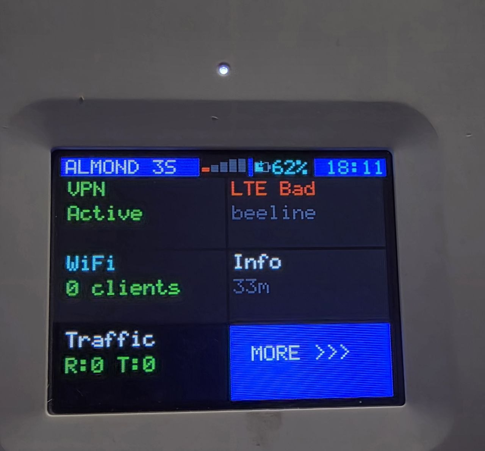

# Securifi Almond 3S — OpenWrt with Display & Touchscreen

Running OpenWrt on Securifi Almond 3S with full hardware support: ILI9341 LCD display, SX8650 touchscreen, PIC16 battery management, LTE modem, and VPN.

## Hardware

| Component | Chip | Interface | Status |
|-----------|------|-----------|--------|
| SoC | MediaTek MT7621 (MIPS 1004Kc, 880MHz, 4 threads) | — | Working |
| RAM / Flash | 256 MB DDR3 / 64 MB NAND | — | Working |
| WiFi 5GHz | MT7662E | PCIe (mt7615e) | Working |
| WiFi 2.4GHz | MT7621 built-in | — | Working |
| LAN | 3x Gigabit (MT7530) | RGMII | Working |
| Display | 2.8" IPS 320x240, ILI9341 | 8-bit parallel 8080-II via GPIO | **Working** |
| Touchscreen | SX8650 resistive 4-wire | I2C bus SM0, addr 0x48 | **Working** |
| LTE Modem | Fibocom L860-GL (Cat16) | miniPCIe USB MBIM | Working |
| Battery MCU | PIC16LF1509 | I2C bus SM0, addr 0x2A | **Working** |
| Battery | 2S Li-Ion, BQ24133 charger | via PIC16 ADC | **Working** |

## LCD UI Architecture

```
[data_collector]  ── JSON ──>  /tmp/lcd_data.json
                                       |
[touch_poll]      ── file ──>  /tmp/.lcd_touch
                                       |
                               [lcd_ui.uc]  (ucode: uloop + ubus + uci)
                                       |
                               JSON via unix socket
                                       |
                               [lcd_render]  ── write() ──>  /dev/lcd
                                                                |
                                                         [lcd_drv.ko]
                                                    GPIO bit-bang → ILI9341
                                                    I2C → SX8650 touch
                                                    I2C → PIC16 battery
```

### Components

| Component | Language | Description |
|-----------|----------|-------------|
| `lcd_drv.ko` | C (kernel) | Framebuffer + GPIO bit-bang + touch + PIC battery + splash |
| `lcd_render` | C | Unix socket server, JSON draw commands → /dev/lcd |
| `lcd_ui.uc` | ucode | UI logic: dashboard, menu, pages (uloop, ubus, uci) |
| `touch_poll` | C | Touch daemon: polls ioctl, writes events to file |
| `data_collector` | C | LTE/WiFi/VPN/Battery stats every 2 sec |

### UI Pages

- **Dashboard** — LTE quality (color-coded), VPN type, ping, WiFi clients, battery, uptime
- **Menu** — 6 buttons (2x3 grid): VPN, LTE, WiFi, Info, IP, MORE
- **VPN** — WireGuard / OpenVPN / L2TP selection + ON/OFF
- **LTE** — RSRQ/Traffic/Ping graphs, band, operator
- **WiFi** — SSIDs, connected clients with signal/traffic
- **Info** — System info, kernel version, LTE details
- **Screensaver** — Bouncing clock (anti-burn-in), then backlight off

## Building

### Full firmware (recommended)

Based on [fildunsky/openwrt](https://github.com/fildunsky/openwrt) `almond-25.12` branch, kernel 6.12.

OpenWrt packages pull sources from this repo at build time:
- **kmod-lcd-gpio** — kernel module
- **lcd-ui** — userspace + init.d

```bash
cd /path/to/fildunsky_openwrt
make menuconfig   # Enable kmod-lcd-gpio + lcd-ui
make -j$(nproc)
```

### Quick build (development)

```bash
cp build_config.sh.example build_config.sh
./build.sh kernel      # lcd_drv.ko via build server
./build.sh userspace   # zig cc locally
./build.sh deploy      # scp to router
```

See [docs/BUILD.md](docs/BUILD.md) for details.

## Setup after flashing

```bash
./install_to_router.sh              # full setup + VPN keys
./install_to_router.sh --public     # without private keys
```

See [docs/FIRST_CHECK_SETUP.md](docs/FIRST_CHECK_SETUP.md) for verification checklist.

## /dev/lcd Interface

| Operation | Description |
|-----------|-------------|
| `write()` | Framebuffer data (320x240 RGB565 = 153600 bytes) |
| `write "touch_start"` | Init SX8650 + start touch thread |
| `ioctl(0)` | Flush framebuffer, stop splash |
| `ioctl(1, int[3])` | Read touch: `{x, y, pressed}` |
| `ioctl(2, u8[17])` | Read PIC battery (last periodic read) |
| `ioctl(4, 0/1/2)` | Backlight: OFF / ON / splash |
| `ioctl(5, N)` | Scene select (0-5, 99=random, 100=stop) |

## PIC16 Battery Protocol

SSPOV in PIC MSSP requires reinit before every read:

```
cmd 0x39 (SSP REINIT) → cmd 0x36 (ADC READ) → read 6 bytes
ADC = (buf[1] << 2) | (buf[2] >> 6)  // 10-bit
Validate: buf[3]==0x02 && buf[4]==0x04
Charger: buf[5] (0x00=no, 0x01=yes)
```

See [Battery_Drain/](Battery_Drain/) for discharge analysis and remaining time estimation algorithm.

## Known Issues

- **Buzzer** — PIC melody player (Timer1 ISR), multi-byte SM0 write broken
- **~5-10% corrupted battery reads** — filtered by validation
- **Reboot** — PIC16 controls power, use power button

## Documentation

- [docs/BUILD.md](docs/BUILD.md) — Build system
- [docs/GUIDE_SETUP_ON_OPENWRT.md](docs/GUIDE_SETUP_ON_OPENWRT.md) — Full setup guide
- [docs/LCD.md](docs/LCD.md) — ILI9341 display driver
- [docs/TOUCH.md](docs/TOUCH.md) — SX8650 touchscreen
- [docs/Fibocom_Setup.md](docs/Fibocom_Setup.md) — LTE modem
- [Battery_Drain/Battery_Drain_ALGO.md](Battery_Drain/Battery_Drain_ALGO.md) — Battery algorithm
- [docs/ideas/PIC_FIRMWARE_ANALYSIS.md](docs/ideas/PIC_FIRMWARE_ANALYSIS.md) — PIC16 firmware reverse engineering
- [docs/ideas/pic_firmware.hex](docs/ideas/pic_firmware.hex) — PIC16 firmware dump (Intel HEX)

## Credits

- OpenWrt base: [fildunsky/openwrt](https://github.com/fildunsky/openwrt)
- Display/touch protocol reverse engineered from stock firmware (kernel 3.10.14)
- PIC16 firmware dumped and analyzed via [PICkit 3](docs/ideas/TODO_PICkit.md)
- Community: [4PDA forum](https://4pda.to/forum/index.php?showtopic=1116429)

## License

GPL-2.0
